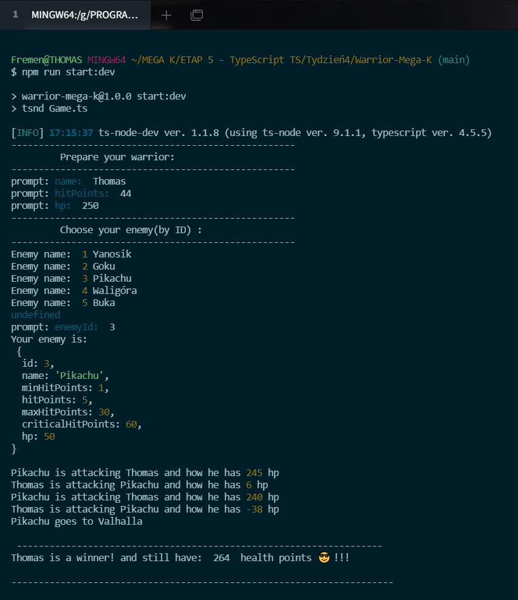

# Warrior-MegaK

## It's excercise which have a goal to train refactoring from JavaScript to TypeScript. Excercise from previous modules of MEGA-K course with continous improvement.

- [x] Open oryginal project in JS
- [x] Initiate package json: npm init -y
- [x] Install nessesary TypeScript dev dependencies:

    - [x] npm i -D ts-node
    - [x] npm i -D ts-node-dev
    - [x] npm i -D typescript


- [x] create tsconfig.json and setup as below:


```
 {
"compilerOptions": {
  "noImplicitAny": true,
  "preserveConstEnums": true,
  "sourceMap": true,
  "target": "es6",
  "downlevelIteration": true,
  "lib": [
    // "dom",
    "es6",
    "dom.iterable"
     ],
  "outDir": "dist",
  "experimentalDecorators": true,
  "emitDecoratorMetadata": true,
  }
}
```

- [x] Create scripts for TypeScript run:

```  
 "scripts": {
  "start": "ts-node index.ts",
  "start:dev": "tsnd index.ts"
  }
```



